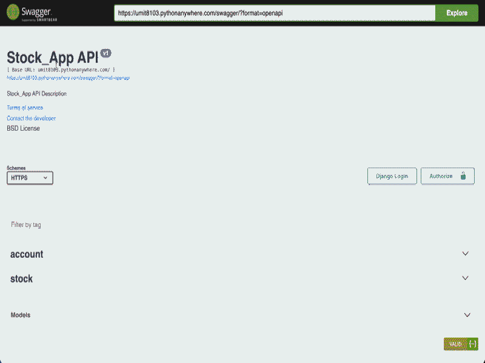

<p align="center">
  
  
  
  
</p>

<h1 align="center">📊 Stock Management Rest API</h1>

<p align="center"><strong>A professional, production-ready REST API for modern inventory tracking and warehouse management systems 🚀</strong></p>

<div align="center">
  <h3>
    <a href="https://umit8103.pythonanywhere.com/swagger/">
      🖥️ Live Demo (Swagger)
    </a>
     | 
    <a href="https://github.com/umitarat-dev/stock-management-rest-api.git">
      📂 Repository
    </a>
  </h3>
</div>

<p align="center">
  <a href="https://umit8103.pythonanywhere.com/swagger/">
    
  </a>
</p>

## 📚 Navigation
- [🚀 Live API Documentation](#-live-api-documentation)
- [📦 Key Features](#-key-features)
- [🛠️ Built With](#️-built-with)
- [⚙️ Setup & Installation](#️-setup--installation)
- [📊 Data Model (ERD)](#-data-model-erd)
- [📬 Contact Information](#-contact-information)

## 🚀 Live API Documentation
The API is fully documented and interactive. You can explore endpoints using Swagger or ReDoc.
* **Swagger UI:** [https://umit8103.pythonanywhere.com/swagger/](https://umit8103.pythonanywhere.com/swagger/)
* **ReDoc:** [https://umit8103.pythonanywhere.com/redoc/](https://umit8103.pythonanywhere.com/redoc/)
* **Postman Collection:** [Explore on Postman](https://umit-dev.postman.co/workspace/Team-Workspace~7e9925db-bf34-4ab9-802e-6deb333b7a46/collection/17531143-9c7e9dbb-cadb-4cb7-bb41-7399ad499c3e)

> **Pro Tip:** In production (`ENV=prod`), root access is automatically redirected to the Swagger documentation for an optimal developer experience.


## 📦 Key Features
* **Inventory & Warehouse Tracking:** Comprehensive CRUD operations for managing brands, products, and categories.
* **Role-Based Access Control (RBAC):** Granular permissions for Superusers, Staff, and Regular Users using `dj-rest-auth`.
* **Data Integrity:** Implementation of `transaction.atomic` for critical stock updates to prevent race conditions.
* **Advanced Filtering:** Integration with `django-filter` for precise querying across large datasets.
* **Professional Logging & Debugging:** Configured system logs and Django Debug Toolbar for high-performance maintenance.
* **Environment-Aware Config:** Hybrid setup optimized for SQLite (Local) and PostgreSQL (Production).


## 🛠️ Built With
* **Framework:** [Django 5.2](https://www.djangoproject.com/) & [Django REST Framework](https://www.django-rest-framework.org/)
* **Authentication:** [dj-rest-auth](https://dj-rest-auth.readthedocs.io/) (JWT Ready)
* **Database:** PostgreSQL (Production) & SQLite (Development)
* **Tools:** [drf-yasg (Swagger/Redoc)](https://drf-yasg.readthedocs.io/), [Django Debug Toolbar](https://django-debug-toolbar.readthedocs.io/)


## ⚙️ Setup & Installation

### Option 1: Local Development (macOS/Linux/Windows)

#### 1. Clone & Environment:
```bash
git clone [https://github.com/umitarat-dev/stock-management-rest-api.git](https://github.com/umitarat-dev/stock-management-rest-api.git)
cd stock-management-rest-api
python -m venv env
source env/bin/activate  # Windows: env\Scripts\activate
```

#### 2. Configuration:
- Create a .env file in the root directory:
```bash
SECRET_KEY=your_secret_key
ENV=dev  # Switch to 'prod' for PostgreSQL
DEBUG=True
ALLOWED_HOSTS=127.0.0.1,localhost
```

#### 3. Install & Run:
```bash
pip install -r requirements.txt
python manage.py migrate
python manage.py runserver
```

### Option 2: Production (PythonAnywhere Deployment)
- The project is optimized for PythonAnywhere with dynamic ALLOWED_HOSTS and decoupled settings.


## 📊 Data Model (ERD)
- The application follows a highly relational structure designed for data integrity:


## 📬 Contact Information

I am open to discussing backend architecture, API design, and professional collaborations.

* **LinkedIn:** [linkedin.com/in/umit-arat](https://www.linkedin.com/in/umit-arat/)
* **Email:** [umitarat8098@gmail.com](mailto:umitarat8098@gmail.com)
* **GitHub:** [github.com/umitarat-dev](https://github.com/umitarat-dev) (Current Workspace)
